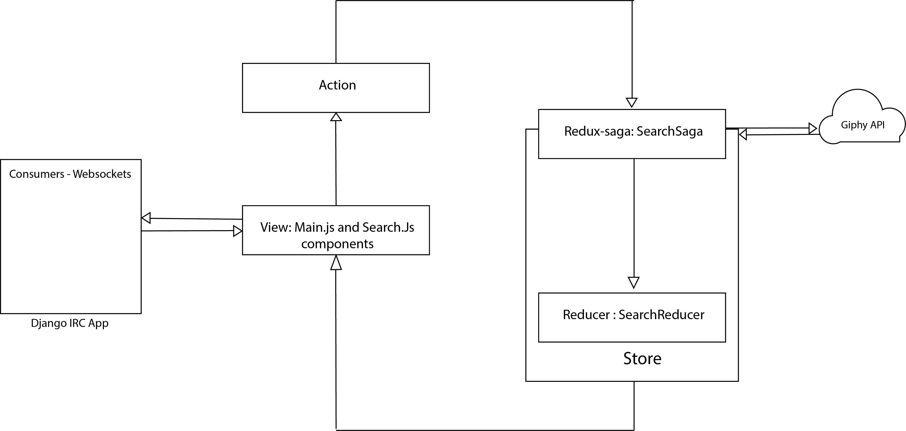

# IRC CHAT

## Description: 

Simple IRC powered by Django channels and React

## Instalation steps:

* Install docker and execute: docker run -p 6379:6379 -d redis:5
* Install virtualenv for python backend and install with pip install -r requirements.txt
* Install React frontend with npm install. Create and '.env' file with the Giphy Api Key as 'REACT_APP_API_KEY'

## App design:

